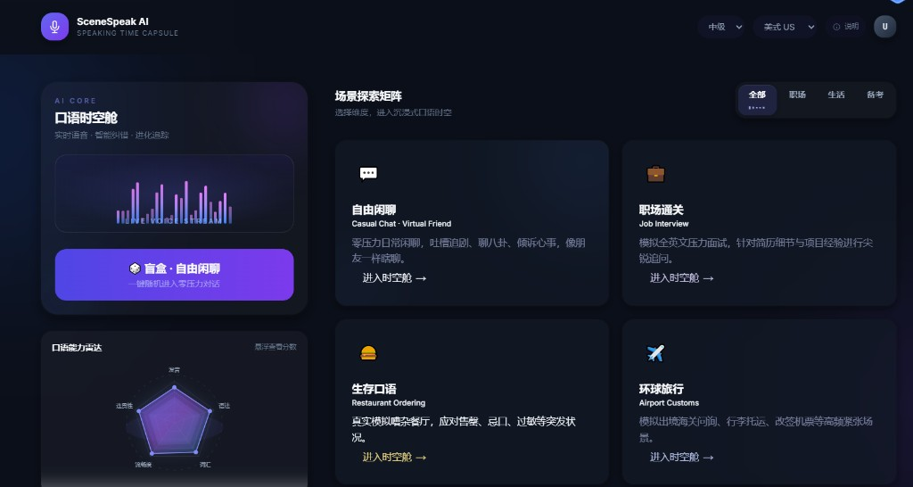
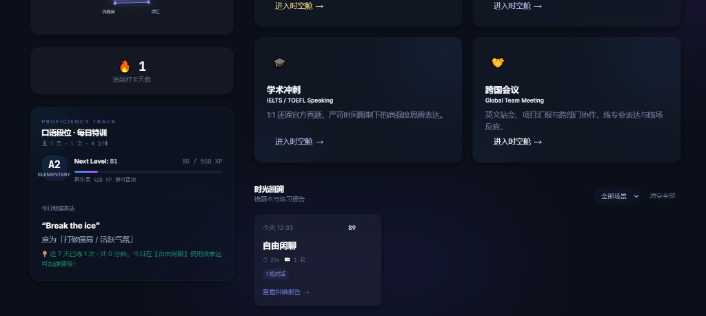
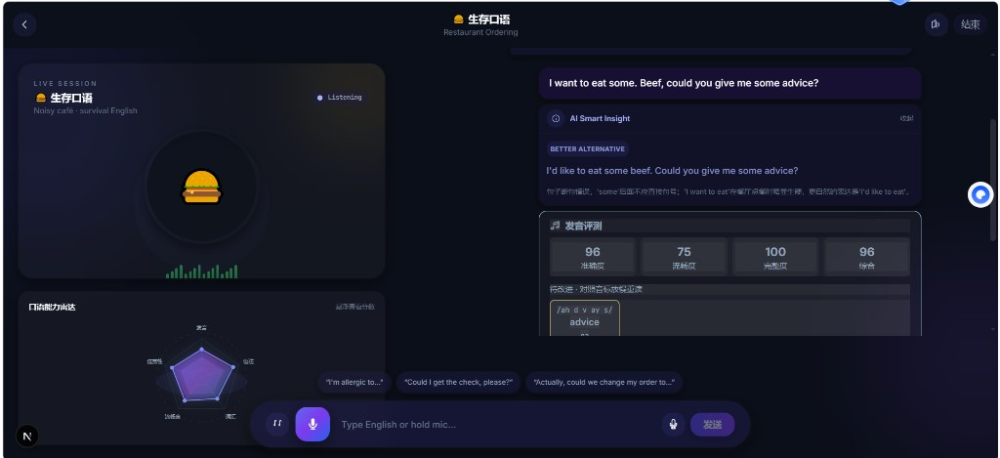
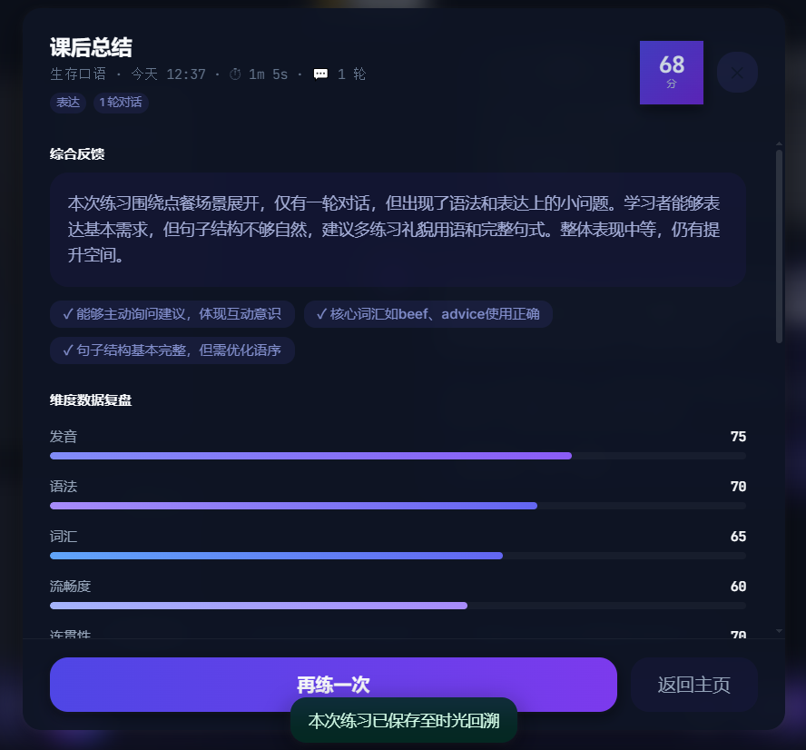

# SceneSpeak AI — AI 英语口语陪练

> 面向真实场景的 AI 英语口语练习工具：场景化对话 · 实时语音 · 发音评测 · 语法纠错 · 课后总结 · 时光回溯

**线上地址（即将上线）**：[https://www.scenespeak.cn](https://www.scenespeak.cn)

<p align="center">
  
</p>

<p align="center">
  
  &nbsp;
  
</p>

<p align="center">
  
</p>

## 功能亮点

- **场景探索矩阵** — 自由闲聊、职场面试、餐厅点餐、环球旅行、雅思口语、跨国会议等 6 大场景
- **沉浸式对话舱** — 深色赛博 UI、AI 虚拟教练、实时纠错与发音评测
- **课后 LLM 报告** — 五维雷达评分（发音 / 语法 / 词汇 / 流畅度 / 连贯性）+ 提升建议
- **时光回溯** — 本地持久化练习历史，支持筛选、删除、纠错报告回看
- **进化追踪** — 近 7 次练习驱动雷达图、连续打卡与每日地道表达特训
- **访问密码保护** — 部署后可配置站点密码，防止 API 被未授权盗刷

## 生产部署（www.scenespeak.cn）

计划上线域名：**https://www.scenespeak.cn**

推荐架构：Nginx（HTTPS）→ Next.js 前端（公网）→ FastAPI 后端（仅内网 `127.0.0.1:8000`，由 Next 反向代理 `/api`）。

### 后端 `backend/.env`（生产）

```env
SITE_ACCESS_PASSWORD=<强密码，仅团队知晓>
AUTH_SECRET_KEY=<随机长字符串，可选但推荐>
AUTH_TOKEN_TTL_HOURS=168
CORS_ORIGINS=https://www.scenespeak.cn,https://scenespeak.cn
HOST=127.0.0.1
PORT=8000
```

### 前端 `frontend/.env.local`（生产）

```env
ACCESS_PASSWORD_REQUIRED=true
BACKEND_URL=http://127.0.0.1:8000
NEXT_PUBLIC_WS_URL=wss://www.scenespeak.cn/api/chat/ws
```

### 上线检查清单

- [ ] DNS 将 `www.scenespeak.cn` 解析至服务器
- [ ] 配置 HTTPS 证书（Let's Encrypt / 云厂商）
- [ ] 设置 `SITE_ACCESS_PASSWORD` 与 `ACCESS_PASSWORD_REQUIRED=true`
- [ ] **不要**公网暴露 8000 端口，仅 Nginx 转发 443 → 3000
- [ ] 云 API（LLM / STT / TTS）控制台设置额度告警

用户首次访问 `www.scenespeak.cn` 将进入 `/login`，验证密码后方可使用口语时空舱。

## 技术架构

| 层级 | 技术栈 | 职责 |
|------|--------|------|
| 前端 | Next.js 15 (App Router) + TypeScript + Tailwind CSS | 场景选择、录音交互、对话流、评测报告、历史管理 |
| 后端 | FastAPI + SSE / WebSocket | 会话管理、LLM 对话、STT / TTS、发音评测、报告生成 |
| AI 服务 | OpenAI-compatible API | 大模型对话、结构化纠错、课后总结 |

## 项目结构

```
.
├── frontend/                 # Next.js 前端
│   └── src/
│       ├── app/              # 页面与布局
│       ├── components/       # UI（对话舱、场景矩阵、报告弹窗等）
│       ├── hooks/            # 录音、TTS、Coach UI
│       ├── lib/              # API、历史存储、设计系统
│       └── types/            # TypeScript 类型
├── backend/                  # FastAPI 后端
│   └── app/
│       ├── api/routes/       # REST 路由（场景、会话、对话）
│       ├── services/         # LLM、STT、TTS、报告、纠错
│       └── prompts/          # 场景 Prompt、纠错、报告 Prompt
├── docs/screenshots/         # README 展示截图
└── README.md
```

## 快速开始

### 1. 后端

```bash
cd backend
python3 -m venv .venv
source .venv/bin/activate        # Windows: .venv\Scripts\activate
pip install -r requirements.txt
cp .env.example .env             # 填入 API Key 等配置
uvicorn app.main:app --reload --host 127.0.0.1 --port 8000
```

健康检查：<http://localhost:8000/health>

### 2. 前端

```bash
cd frontend
npm install
cp .env.example .env.local
npm run dev
```

访问：<http://localhost:3000>

## 环境变量

| 文件 | 说明 |
|------|------|
| `backend/.env` | LLM API Key、模型名称、STT/TTS 配置、CORS 等 |
| `frontend/.env.local` | 可选：`NEXT_PUBLIC_API_URL` 直连后端地址 |

### 部署访问密码（防 API 盗刷）

在 `backend/.env` 设置：

```env
SITE_ACCESS_PASSWORD=你的强密码
CORS_ORIGINS=https://www.scenespeak.cn,https://scenespeak.cn
```

在 `frontend/.env.local` 设置：

```env
ACCESS_PASSWORD_REQUIRED=true
BACKEND_URL=http://127.0.0.1:8000   # 或内网后端地址
```

效果：

- 未登录无法打开主页（Next.js 中间件）
- 所有 `/api/*` 请求需 `Authorization: Bearer <token>`（FastAPI 中间件）
- 开启密码后自动关闭 `/docs` OpenAPI 文档
- 本地开发：`SITE_ACCESS_PASSWORD` 留空即可，无需登录

> `.env` 与 `.env.local` 已被 `.gitignore` 忽略，请勿提交敏感信息。

## 开发进度

- [x] 深色赛博 UI 与设计系统（Squircle、TintedOverlay、雷达图）
- [x] 6 场景矩阵 + 盲盒随机进入
- [x] 流式对话 + 并行语法纠错 + 发音评测
- [x] 后端 `/api/session/{id}/end` LLM 课后报告
- [x] 时光回溯（localStorage 持久化、CRUD、场景筛选）
- [x] 进化追踪（近 7 次练习驱动雷达 / 打卡 / 每日特训）
- [x] 站点访问密码（Bearer Token + 登录页，防 API 盗刷）
- [ ] www.scenespeak.cn 生产环境部署与 HTTPS
- [ ] 后端数据库持久化与用户账号体系

## License

MIT（Demo 项目，按需调整）
